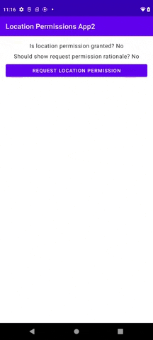

# Request runtime permissions example workaround for API limitations

This Android application demonstrates a workaround for the "request permission at runtime" API
limitation demonstrated in [app1](../app1).

Specifically, the application remembers in persistent storage when the user has seen and
acknowledged the "request permission rationale" popup. The app uses this piece of information as a
heuristic to determine when it should direct the user to the app's "Application Info" screen in
Settings instead of requesting permission from the user directly.

Here's an example of the app running on an Android 12 device:

Take care to clear the heuristic in the scenario where the user grants the permission to the app
after seeing the "request permission rationale" popup. If you don't do this, you'll end up in a
scenario – when the app is killed and restarted – where you're directing the user to the app's "
Application Info" screen when you are in fact entitled to request permission from the user directly.

All of the logic of interest in this app is in
the [MainActivity](src/main/java/com/tazkiyatech/app/MainActivity.kt) class.
