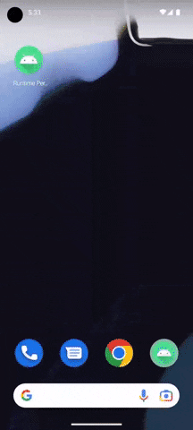

# Demonstration of how to request the "post notifications" permission and how to deal with rejection

## Introduction

This Android application demonstrates how to check whether the user has granted permission to post notifications
and it demonstrates how to request permission where permission is required.

This application not only checks and requests the [POST_NOTIFICATIONS](https://developer.android.com/reference/android/Manifest.permission#POST_NOTIFICATIONS) runtime permission
as is required on Android 13+ devices but it goes further and checks whether the notification channel is enabled.
If the notification channel is disabled, it directs the user to the exact place in the Settings app where they can enable the notification channel.

## Show me the code!

Start off by looking at the code in the [MainActivity](src/main/java/com/tazkiyatech/app/MainActivity.kt) class.
That's the place in the application which posts notifications and checks whether notifications can be posted.

## Demo

Here is an example of the app running on an Android 13 device:

